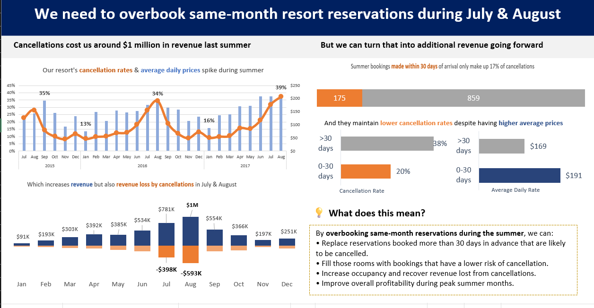

# 🏨 Maven Hotel Group Booking Cancellation Analysis Dashboard | Excel

A business-focused hotel booking analytics dashboard built in Microsoft Excel to identify cancellation trends, revenue leakage, and opportunities to improve occupancy and profitability.

---

## 📸 Dashboard Preview

---

## 🎯 Business Impact

* Identified approximately **$1 million in revenue loss** caused by booking cancellations during peak summer months.
* Analyzed booking lead times to uncover high-risk reservation patterns.
* Discovered that same-month bookings had lower cancellation rates and higher Average Daily Rates (ADR).
* Recommended an overbooking strategy to improve occupancy and recover lost revenue.

---

## 🚀 Project Objectives

* Analyze hotel booking and cancellation patterns
* Identify key drivers of revenue loss
* Evaluate the impact of booking lead times on cancellations
* Discover opportunities to improve occupancy and revenue
* Present actionable business recommendations through an executive dashboard

---

## 📊 Key Dashboard Insights

### Cancellation Trends

* Cancellation rates increase significantly during peak summer months.
* Average Daily Rates (ADR) and cancellation rates follow similar seasonal patterns.

### Revenue Impact

* Hotel cancellations resulted in approximately **$1 million in lost revenue** during July and August.

### Lead Time Findings

* Reservations booked more than 30 days in advance accounted for the majority of cancellations.
* Same-month reservations demonstrated significantly lower cancellation rates.

### Business Opportunity

* Same-month bookings generated higher Average Daily Rates while maintaining lower cancellation risk.

---

## 💡 Business Recommendation

Overbook same-month resort reservations during July and August to:

* Offset expected cancellations from long-term bookings
* Improve room occupancy
* Recover lost revenue
* Increase overall profitability during peak seasons

---

## 🛠 Tools & Technologies

* Microsoft Excel
* Pivot Tables
* Pivot Charts
* Combo Charts
* Data Visualization
* Dashboard Design

---

## 📈 Skills Demonstrated

* Data Analysis
* Business Intelligence
* Dashboard Design
* KPI Reporting
* Data Visualization
* Excel Analytics
* Data Storytelling
* Revenue Analysis
* Business Recommendation Development

---

## 📁 Files Included

* MHG_Booking_Data.xlsx
* Dashboard Screenshot.png
* MHG_Booking_Data_Dashboard.pdf

Aspiring Data Analyst | SQL | Excel | Power BI | Python

